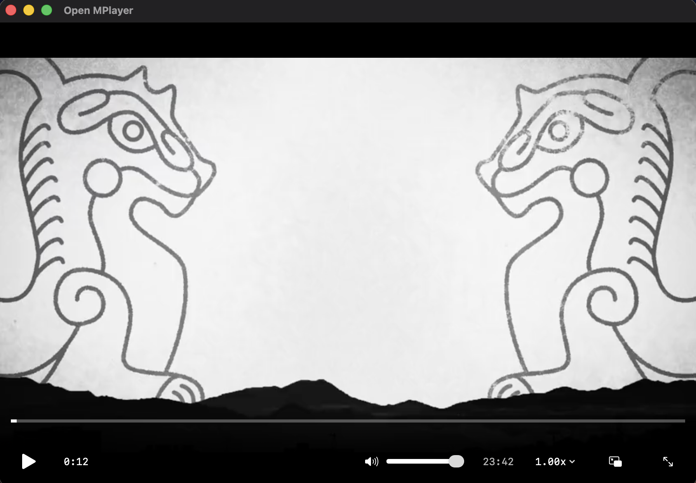
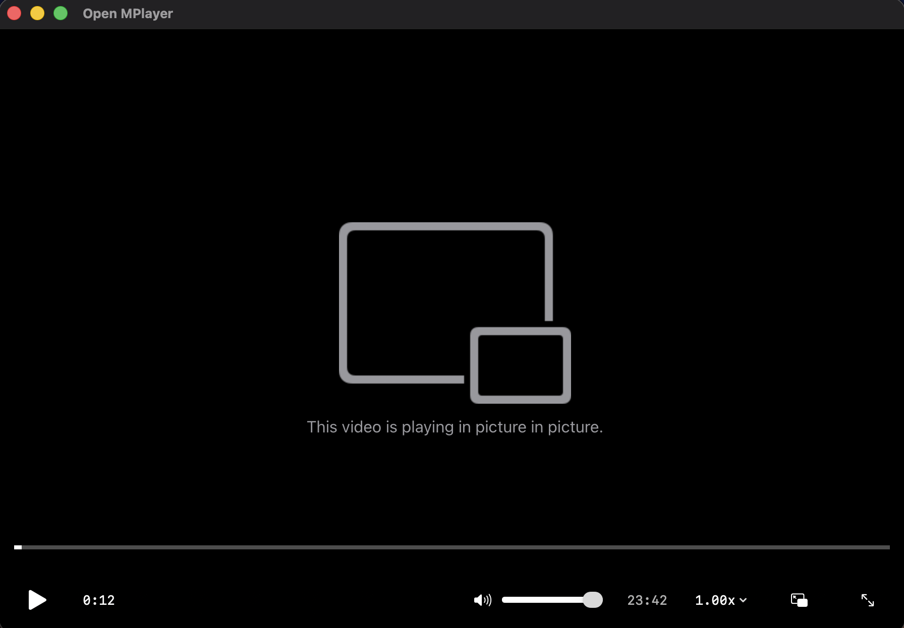
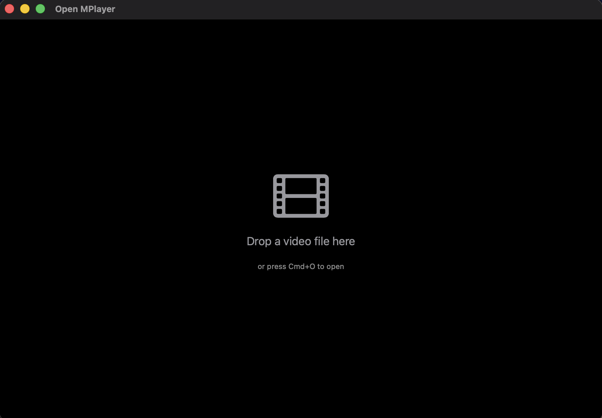

# Open MPlayer

> **Frustrated that your favorite media player stopped working after upgrading to macOS Tahoe?**  
> Open MPlayer is a modern, native alternative built specifically for macOS 15.0+. No more crashes, no more compatibility issues—just smooth, reliable video playback with a beautiful native interface.

A modern, native macOS media player built with Swift and SwiftUI. Designed for macOS Tahoe (15.0) and later.

## Screenshots

<p align="center">
  
  
</p>

<p align="center">
  
  
</p>

## Features

### Current
- 🎬 Native AVFoundation playback engine
- 🎨 Modern SwiftUI interface
- 📁 Drag-and-drop file support
- ⌨️ Keyboard shortcuts
- 🌓 Dark mode support
- ⚡ Playback speed control (0.25x - 2.0x)
- 🖼️ Picture-in-Picture mode
- 🌐 HTTP/HTTPS streaming support
- 🎯 Gesture controls (swipe to seek, volume)
- 💾 Smart resume (remembers playback position)
- 🔄 Auto-conversion for MKV/AVI/WebM files

### Planned
- 📝 Subtitle support (SRT, VTT)
- 🎵 Multiple audio track selection
- 🎛️ Video filters and adjustments

## Supported Formats

- **Video**: MP4, MOV, M4V (native AVFoundation support)
- **Video with conversion**: MKV, AVI, WebM, FLV, WMV (requires FFmpeg)
- **Audio**: MP3, AAC, FLAC, WAV, M4A
- **Subtitles**: SRT, VTT (planned)

### FFmpeg Requirement for MKV
To play MKV and other non-native formats, install FFmpeg:
```bash
brew install ffmpeg
```

The app will automatically convert these files to MP4 on-the-fly for playback.

## Requirements

- macOS Tahoe (15.0) or later
- Xcode 15.0+ (for building from source)

## Installation

### Option 1: Quick Install Script (Recommended)
```bash
cd open-mplayer
./install.sh
```
This will build the app and install it to `/Applications/OpenMPlayer.app`.

### Option 2: Download Pre-built App (Coming Soon)
Download the latest release from the [Releases](https://github.com/yourusername/open-mplayer/releases) page.

### Option 3: Build from Source

1. **Clone the repository**
   ```bash
   git clone https://github.com/yourusername/open-mplayer.git
   cd open-mplayer
   ```

2. **Open in Xcode**
   ```bash
   open OpenMPlayer.xcodeproj
   ```

3. **Build and Run**
   - Select your Mac as the target device
   - Press `Cmd + R` to build and run
   - Or use `Cmd + B` to build only

4. **Create Release Build**
   ```bash
   xcodebuild -project OpenMPlayer.xcodeproj \
              -scheme OpenMPlayer \
              -configuration Release \
              -derivedDataPath ./build
   ```
   
   The app will be located at:
   ```
   ./build/Build/Products/Release/OpenMPlayer.app
   ```

5. **Install to Applications**
   ```bash
   cp -r ./build/Build/Products/Release/OpenMPlayer.app /Applications/
   ```

## Usage

### Opening Files
- **Drag and drop** a video file onto the app window
- **File menu**: `File > Open...` (Cmd + O)
- **URL streaming**: `File > Open URL...` (Cmd + U)
- **Right-click** a video file and select "Open With > OpenMPlayer"

### Keyboard Shortcuts
- `Space` - Play/Pause
- `←` / `→` - Seek backward/forward 5 seconds
- `↑` / `↓` - Volume up/down
- `[` / `]` - Decrease/increase playback speed
- `\` - Reset to normal speed (1.0x)
- `F` - Toggle fullscreen
- `Cmd + O` - Open file
- `Cmd + U` - Open URL
- `Cmd + W` - Close window
- `Cmd + Q` - Quit app

### Playback Controls
- Click the play/pause button or press `Space`
- Drag the timeline scrubber to seek
- Adjust volume with the slider or arrow keys
- Click speed menu to change playback rate
- Click PiP button to enter Picture-in-Picture mode
- Double-click video for fullscreen

### Gesture Controls
- **Horizontal swipe** on video - Seek forward/backward
- **Vertical swipe** on video - Adjust volume
- Visual feedback shows seek amount or volume level

## Development

### Project Structure
```
OpenMPlayer/
├── Sources/
│   ├── App/
│   │   └── OpenMPlayerApp.swift      # App entry point
│   ├── UI/
│   │   ├── PlayerView.swift          # Main player interface
│   │   ├── ControlsView.swift        # Playback controls
│   │   └── VideoPlayerLayerView.swift # Video rendering layer
│   └── PlaybackEngine/
│       ├── PlayerController.swift    # AVFoundation wrapper
│       ├── MediaConverter.swift      # FFmpeg integration
│       └── PlaybackHistory.swift     # Smart resume
├── Resources/
│   ├── Assets.xcassets/              # App icons and images
│   ├── Info.plist                    # App configuration
│   ├── OpenMPlayer.entitlements      # App permissions
│   └── open-mplayer-logo.png         # Original logo file
├── install.sh                        # Quick install script
├── IMPLEMENTATION_PLAN.md            # Feature implementation guide
└── AGENTS.md                         # Agent collaboration guide
```

### Building for Development
```bash
# Run tests
xcodebuild test -project OpenMPlayer.xcodeproj -scheme OpenMPlayer

# Build debug version
xcodebuild -project OpenMPlayer.xcodeproj \
           -scheme OpenMPlayer \
           -configuration Debug
```

### Code Style
- Swift 5.9+
- SwiftUI for all UI components
- Async/await for asynchronous operations
- Follow [Apple's Swift API Design Guidelines](https://swift.org/documentation/api-design-guidelines/)

## Troubleshooting

### App crashes on launch
- Ensure you're running macOS Tahoe (15.0) or later
- Check Console.app for crash logs
- Try rebuilding with `xcodebuild clean build`

### Video won't play
- Verify the file format is supported
- Check file permissions
- Try converting the file with HandBrake or FFmpeg

### Performance issues
- Close other applications
- Check Activity Monitor for CPU/memory usage
- Try reducing video quality or resolution

## Contributing

Contributions are welcome! Please:
1. Fork the repository
2. Create a feature branch (`git checkout -b feature/amazing-feature`)
3. Commit your changes (`git commit -m 'Add amazing feature'`)
4. Push to the branch (`git push origin feature/amazing-feature`)
5. Open a Pull Request

See [AGENTS.md](AGENTS.md) for architecture and collaboration guidelines.

## License

MIT License - see [LICENSE](LICENSE) file for details.

## Acknowledgments

- Built with Apple's AVFoundation and SwiftUI frameworks
- Inspired by VLC Media Player and IINA
- Created as a native macOS Tahoe-compatible alternative

## Support

- 🐛 [Report bugs](https://github.com/yourusername/open-mplayer/issues)
- 💡 [Request features](https://github.com/yourusername/open-mplayer/issues)
- 📧 Contact: kevin@laurenscodes.space
